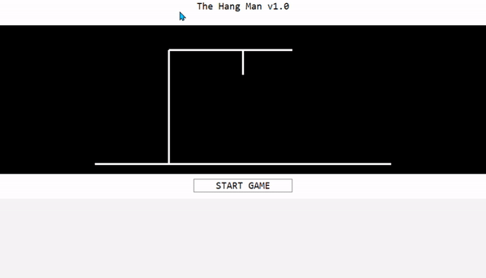
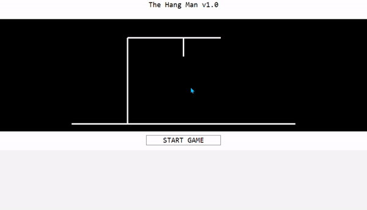

# The Hang Man Game

This game is implemented with C# and WPF form.

Executable: `Demo.exe`

Visual Studio project files: `Project.csproj`

## Design

In order to dynamically generate most of the UI, I have used three `Canvas` inside the `StackPanel`.

There are 4 major variables involved in the decision making:  
- `ansList: string[]`  
- `ANSWER: string`  
- `GUESS: string`  
- `count: int`  

The main flow of my game design:

- Game preparation
    - One element will be drawn from `ansList` as the `ANSWER`.
    - `GUESS` will be initialized  as the copy of `ANSWER` with `[A-Z]`replace by `*`
- Playing stage
  - Player clicks the dynamically generated letter button
     -  If correct -> Replace `GUESS` with correct letter
     -  If incorrect -> Increase `count`, invoke the `drawHangMan()` and set button `Visibility` to `Hidden`
  - Disable the button clicked

- Winning/Losing stage
  - Check if `GUESS == ANSWER`
  - Then check if `count == 6`
  - Call `showWin()` or `showLose()` if possible

## Screen Capture
### Winning

### Losing

